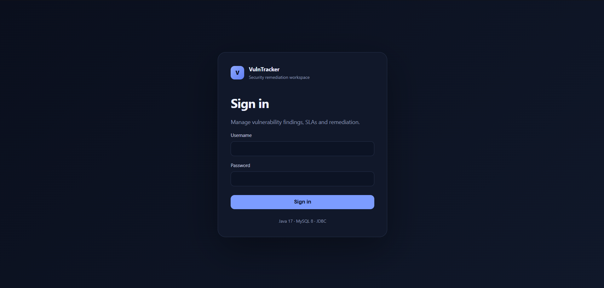
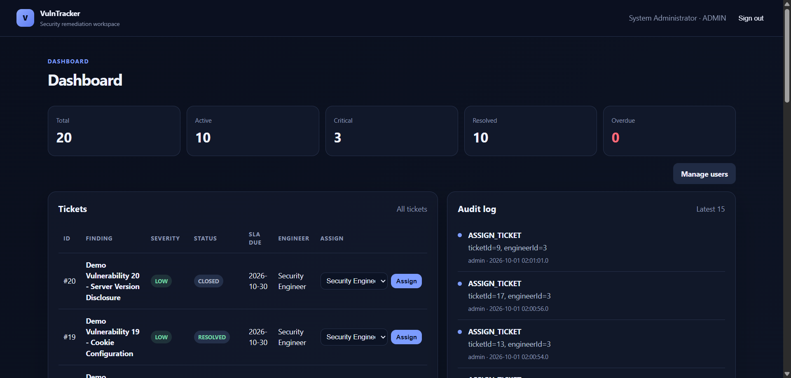
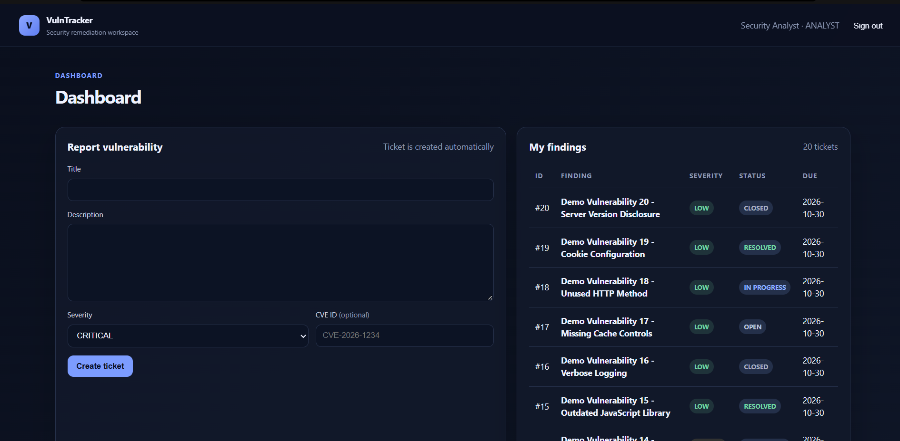
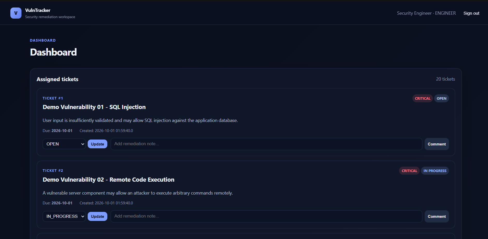

# Online Vulnerability / Ticket Tracker

Role-based security vulnerability management and remediation workflow system for the MCA minor project.

## Stack
- Java 17
- MySQL 8.0
- JDBC
- Maven
- JUnit 5

## Workflow
1. Analyst reports a vulnerability.
2. The application creates a ticket in the same database transaction.
3. MySQL calculates the due date from severity using a `BEFORE INSERT` trigger.
4. Admin assigns the ticket to an Engineer.
5. Engineer changes ticket status and adds comments.
6. User actions are written to `audit_log`.

## Architecture

```text
Browser / Console
       |
       v
+----------------------+
| Java Web UI / CLI    |
+----------------------+
       |
       v
+----------------------+
| Service Layer         |
| - Authentication      |
| - Ticket Workflow     |
| - SLA Management      |
| - Comments / Audit    |
+----------------------+
       |
       v
+----------------------+
| JDBC / DAO Layer      |
+----------------------+
       |
       v
+----------------------+
| MySQL Database        |
| - users               |
| - vulnerability       |
| - ticket              |
| - comment             |
| - audit_log           |
+----------------------+

## SLA
| Severity | SLA |
|---|---:|
| Critical | 1 day |
| High | 3 days |
| Medium | 7 days |
| Low | 30 days |

## Database setup
1. Install MySQL 8.0.
2. Run `sql/schema.sql`.
3. Optionally run `sql/seed.sql` for development accounts.

Do not use the seed passwords in production.

## Environment variables
- `VULNTRACKER_DB_URL` — optional; defaults to `jdbc:mysql://localhost:3306/vulntracker?useSSL=false&serverTimezone=UTC`
- `VULNTRACKER_DB_USER` — optional; defaults to `root`
- `VULNTRACKER_DB_PASSWORD` — database password

Never commit credentials or `.env` files.

## Build and test
```bash
mvn test
mvn package
```

Maven is required for dependency resolution and JUnit execution. The domain classes can also be compiled directly with JDK 17+ when MySQL/JUnit dependencies are not needed.

## Security notes
- Passwords are stored using PBKDF2-HMAC-SHA256 with a per-password random salt.
- SQL operations use prepared statements.
- Role checks are performed in the service layer.
- Analyst report creation and ticket creation use one transaction.
- Engineer status changes are restricted to tickets assigned to that engineer.
- Database foreign keys and the SLA trigger enforce integrity independently of application code.

## Current milestone
Implemented domain model, authentication primitives, JDBC connection, persistence DAOs, transactional vulnerability/ticket workflow services, comments, audit logging, database schema/trigger, and unit-test foundation.

## Integration smoke test

`src/test/java/vulntracker/DatabaseIntegrationCheck.java` is an end-to-end JDBC smoke test for a dedicated development database. It creates temporary users and data, verifies authentication, vulnerability-to-ticket creation, Critical SLA calculation, admin assignment, engineer status updates, comments, and audit logging, then removes the test data.

Run it after the MySQL Connector/J dependency is available on the classpath and `vulntracker` has been initialized with `sql/schema.sql`:

```bash
mvn test
# or run DatabaseIntegrationCheck explicitly from your IDE
```

The integration check has been verified successfully against the local MySQL development database. It covers authentication, vulnerability-to-ticket creation, Critical SLA calculation, admin assignment, engineer status updates, comments, and audit logging, followed by test-data cleanup.

## Web UI

The project includes a browser-based UI built on Java 17's lightweight HTTP server, so no frontend framework or application server is required for the academic project. The console UI remains available.

### Login



### Role-based dashboards

#### Admin



#### Analyst



#### Engineer



Start the web application after building with Maven:

```bash
mvn package
java --add-modules jdk.httpserver -cp target/classes vulntracker.Main web
```

Then open `http://localhost:8080`. Set `VULNTRACKER_WEB_PORT` to use another port.

The web UI provides role-specific dashboards:
- **Admin:** ticket overview, engineer assignment, SLA/status metrics, audit activity.
- **Analyst:** vulnerability reporting with automatic ticket creation and SLA calculation, plus submitted findings.
- **Engineer:** assigned tickets, status updates, and remediation comments.

The UI uses server-side HTML rendering, prepared JDBC queries, output escaping, HttpOnly/SameSite sessions, CSRF request tokens, role checks, and security response headers.
